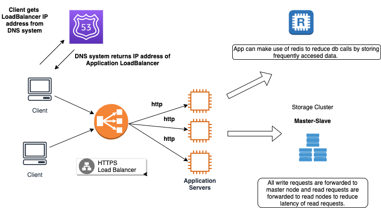
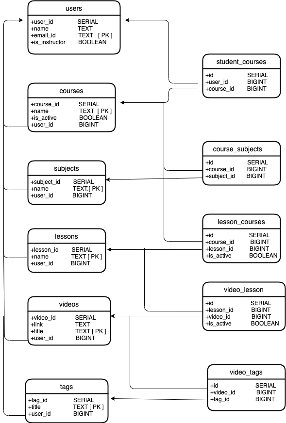

# CoursePortal

***
# Tools and Tech

   > spring-boot-starter-web  
   > spring-boot-starter-test  
   > vertx-web  
   > hikariCp  [ Connection Pooling ]  
   > junit  
   > logback-classic  
   > apache-commons  
   > postregsql [ JDBC client ]   
***
# Architecture

  1) All client requests are routed to load balancer. Requests are routed from the load balancer to the application servers. 
  
     Load balancer takes care of   distributing the incoming traffic across all the application servers based on the configured routing policy.
     
      ### Advantages of LoadBalancer
      
         1) Provides single point of access to our application.
         
         2) Incoming traffic is evenly distributed accross all the application servers.
         
         3) If any of the server is down, it will automatically redirect the requests to healthy servers.
         
         4) SSL offloading, which would free the application server from the burden of decrypting and/or encrypting traffic sent via SSL.
         
         5) As the application servers are inside private network, communication between loadBalancer and application servers happens via http protocol.
    
        
  2)  All the Application servers connects to a relational database cluster for storing and retrieving application data.
  
  3)  As the application is read-intensive application, we deploy a database cluster which follows master-slave architecture.
      
        ### Advantages of master-slave cluster
       
         1) All write requests are directed to master node.
         
         2) All read requests are directed to slave nodes, to reduce latency of read requests.
         
         3) All the read traffic is evenly distributed across slave nodes.
  
  4) Can integrate with caching systems like **Redis** to reduce request latency.
  
       ### Advantages of Caching Systems
       
        1) Can reduce database calls by caching frequenctly accessed data.
        
        2) Reduce request latency by avoiding database call and fetching data directly from cache if it exists
        
   ***   
   ## ER Diagram
     
  
  ***
  ## Prerequisites 
  
      
  * Create Tables
  
       **init_script.sql**
    
          1) This file contains CREATE statements of all the tables required for the application. 
          2) CREATE statements are tested on PostgreSQL database. 
          3) Based on relation database type we may need to update the datatypes in CREATE statements. 
   
  * Deployment properties
           
      - **deployment.properties** file
        
          
  > application.port=8091  
  > db.url=           
  > db.username=      
  > db.password =     
  > db.driver.class.name=    
  > db.connection.pool.size=     
  > db.ssl.enabled=false  
          
       1) Need to configure above properties in deployment.properties file. You can change the port number on which the application runs
          by updating 'application.port' value.
                  
       2) deployment.properties file is present in resources folder.
              
   * JDBC Driver
        
        - Need to add required JDBC driver dependency in pom.xml file. By default application is configured with postgresql driver.
        
   ***
   ## Build    
         
   - **mvn clean install**
            
         This command will generate the application fat jar in ${project.basedir}/build folder.
            
   
    
   ***
   ## Running the application 
        
        java -jar {artifactId}-{version}-fat.jar
   
   ## API
   
   ### User 
   
   ### Create user
   
   * **URL**
   
     /app/portal/user   
   * **Method**
   
     `POST`    
     
   * **Request Body**
   
    {
        "name": "user1",
        "emailId":"user1@gmail",
        "isInstructor":true
    }        

   ### Get user
  
   * **URL**
   
        /app/portal/user
     
   * **Method**
   
        `GET`
        
   * **Headers**          
   
        userId
    
   ### List all users
   
   * **URL**
   
        /app/portal/user/all    
   * **Method**
          
        `GET`
   * **Headers**
   
        userId
    
    
   ***          
   ### Course
   
   ### Create course
   
   * **URL**
    
        /app/portal/course
   
   * **Method**
    
       `POST`
   * **Headers**
        
        userId
   * **Request Body**
      
         {
           "name" : "course1"
         }         
        
   ### Get course
   
   * **URL**
   
        /app/portal/course     
   
   * **Method**
   
        `GET`
        
   * **Headers**
        
        userId
        
        courseId
    
   ### List all courses
   
   * **URL**
   
        /app/portal/course/all
   
   * **Method**
    
        `GET`
        
   * **Headers**
   
        userId
    
   ### Get all active courses
   
   * **URL**
   
        /app/portal/course/activeCourses
        
   * **Method**
    
        `GET`
   * **Headers**
   
        userId
             
   ### Update course
   
   * **URL**
    
        /app/portal/course
        
   * **Method**
        
        `PUT`
        
   * **Headers**
   
        userId
    
   * **Request Body**
        
             {
                "courseId":1,
                "name":"updatedName"
             }                     
             
   ### Delete course
   
   * **URL**
    
        /app/portal/course
   
   * **Method**
   
        `DELETE`
   
   * **Headers**
    
        userId
        
        courseId          
                                    
   ### Subscribe to course
   
   * **URL**
   
        /app/portal/course/subscribe                                  
        
   * **Method**
        
        `PUT`
   
   * **Headers**
   
        courseId
        
        userId
   
   ### Unsubscribe to course
   
   * **URL**
        
        /app/portal/course/unsubscribe           
   
   * **Method**
   
        `PUT`
        
   * **Headers**               
   
        courseId
        
        userId
   
   ### Filter courses by subject
   
   * **URL**
        
        /app/portal/course/subject
        
   * **Method**
   
        `GET`
   
   * **Headers**
        
        userId
        
        subjectId
   
   ***
   
   ### Subject
   
   ### Create subject
   
   * **URL**
        
        /app/portal/subject
   
   * **Method**
   
        `POST`
   
   
   * **Headers**
   
        userId          
   
   * **Request Body**
        
         {
            "name":"subject1"
         }
                      
   ### Get subject
   
   * **URL**
     
       /app/portal/subject             
   
   * **Method**
        
        `GET`
        
   * **Headers**         
        
        userId
   
   ### Delete subject
   
   * **URL**
        
       /app/portal/subject             
      
   * **Method**
   
       `DELETE`
           
   * **Headers**         
           
        userId   
         
   ### Update subject
   
   * **URL**
       
       /app/portal/subject
   
   * **Method**
   
        `PUT`
   
   * **Headers**
        
        userId
    
   * **Request Body**
   
          {
              "subjectId":1,
              "name":"updatedName"
          }                 
           
   ### List all subjects
   
   * **URL**
         
        /app/portal/subject/all
        
   * **Method**      
        
        `GET`
        
   * **Headers**      
        
        userId
        
  ### Add subject to course
        
   * **URL**
   
        /app/portal/subject/add
        
   * **Method**
   
        `POST`
        
   * **Headers**
        
        userId
        
        subjectId
        
        courseId
                  
              
  ***
  
  ### **Lesson**
  
  ### Create lesson      
  
  * **URL**
  
       /app/portal/lesson
       
  * **Method**
  
       `POST`
   
  * **Headers**
         
       userId
 
  * **Request Body**
        
        {
            "name":"lesson1"
            
        }
        
  ### Get lesson                    
  
  * **URL**
    
      /app/portal/lesson
  
  * **Method**
    
      `GET`
      
  * **Headers**
        
       userId
       
       lessonId
  
  ### Delete lesson
  
  * **URL**
  
       /app/portal/lesson
  
  * **Method**
         
      `DELETE`
  
  * **Headers**

      userId
      
      lessonId
                
  
  ### Get all lessons
  
  * **URL**
  
       /app/portal/lesson/all                 
       
  * **Method**
       
       `GET`
  
  * **Headers**
  
       userId
        
   ### Get active lessons in given course
   
   * **URL**
    
       /app/portal/lesson/active   
       
   * **Method**
        
        `GET`
                    
   * **Headers**
        
        userId
        
        courseId                     
        
   ### Add subject to lesson
    
   * **URL**
        
       /app/portal/lesson/add 
        
  * **Method**     
            
       `POST`
  
  * **Headers**
        
       userId
        
       lessonId
        
       subjectId
    
   ### Update active status of lesson in a course
    
   * **URL**
    
        /app/portal/lesson/status    
        
   * **Method**
    
       `PUT`
    
   * **Headers**
    
        userId   
    
   * **Request Body**
    
    
         {
             "lessonId":1,
             "courseId":2,
             "active":true
         }
          
 
 ***
 ### Tag
 
   
 
 ### Create tag
 
 * **URL**
     
      /app/portal/tag
    
 * **Method**
 
      `POST`
 
 * **Headers**
 
    userId
    
 * **Request Body**
    
       { 
          "title" :"tag1"
       }   
         
### Get tag

* **URL**
    
     /app/portal/tag
     
* **Method**
    
    `GET`
 
* **Headers**

    userId
    tagId
    
### Update tag

* **URL**
    
     /app/portal/tag
     
* **Method**
    
    `PUT`

* **Headers**
    
    userId

* **Request Body**

        {
            "title" :"tag1"
        }
                                          
### Delete tag

* **URL**
    
    /app/portal/tag
    
* **Method**

    `DELETE`

* **Headers**
    
    userId
    
    tagId
 
### List all tags

* **URL**
    
    /app/portal/tag/all
    
* **Method**
    
    `GET`
 
* **Headers**
    
     userId
****

### Video

### Create video

* **URL**
    
    /app/portal/video

* **Method**

    `POST`
 
* **Headers**
    
    userId
 
* **Request Body**

       {
           "title":"video1",
           "link":"link1"
        }

### Get video

* **URL**
    
    /app/portal/video
    
* **Method**
    
    `GET`

* **Headers**

    userId
    
    tagId
    
### Delete video

* **URL**
    
    /app/portal/video

* **Method**
    
    `DELETE`

* **Headers**
    
     userId
     
     tagId
 
 ### Update video
 
 * **URL**
    
    /app/portal/video
    
 * **Method**
 
    `PUT`
    
 * **Headers**              
    
    userId
    
 * **Request Body**
 
       {   
           "videoId": "1",
           "link" : "updatedLink", //OPTIONAL
           "title" : "updatedTitle" //OPTIONALE
      }       
          
  
 ### List all videos
 
 * **URL**
    
     /app/portal/video/all
     
 * **Method**
 
      `GET`    
 
 * **Headers**
 
     userId
     
 ### Add video to lesson
 
 * **URL**
    
     /app/portal/video/add/lesson    
 
 * **Method**
       
      `POST`
 
 * **Headers**
    
      userId
      
 * **Request Body**
 
       {
           "videoId": 1,
           "lessonId": 2
       }
 
 ###  Add tag to video
 
 * **URL**
 
    /app/portal/video/add/tag
    
* **Method**
    
     `POST`
     
* **Headers**
   
     userId

* **Request Body**

       {
           "videoId":1,
           "tagId":2
       }
    

### Get video by title

* **URL**
    
    /app/portal/video/title
    
* **Method**
    
     `GET`                                                    

* **Headers**
 
     userId
 
     title
         
                                                     
### Get video by tag title

* **URL**

    /app/portal/video/tag
    
* **Method**
    
     `GET`    

* **Headers**
    
     userId
     
     title   
                                                 
